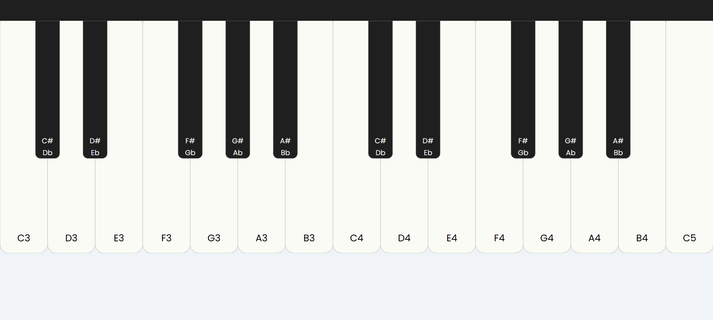

# 🎹 Interactive Piano Keyboard

A visually appealing, browser-based interactive piano keyboard built using **HTML**, **CSS (SVG styling)**, and **JavaScript** with **Tone.js** for sound synthesis.

---

## 🔧 Features

- ✅ Fully functional **interactive keyboard** using SVG.
- ✅ Accurate sound generation using [Tone.js](https://tonejs.github.io/).
- ✅ Responsive UI styled with modern CSS.
- ✅ Clean minimalist **header bar** matching black piano keys for cohesive design.
- ✅ Smooth **hover** and **click animations** for a more tactile feel.

---

## 🛠 Tech Stack

- **HTML5** – Markup structure
- **CSS3 / SVG** – Styling and layout
- **JavaScript (ES6)** – Interactivity and DOM
- **Tone.js** – Web audio synthesis